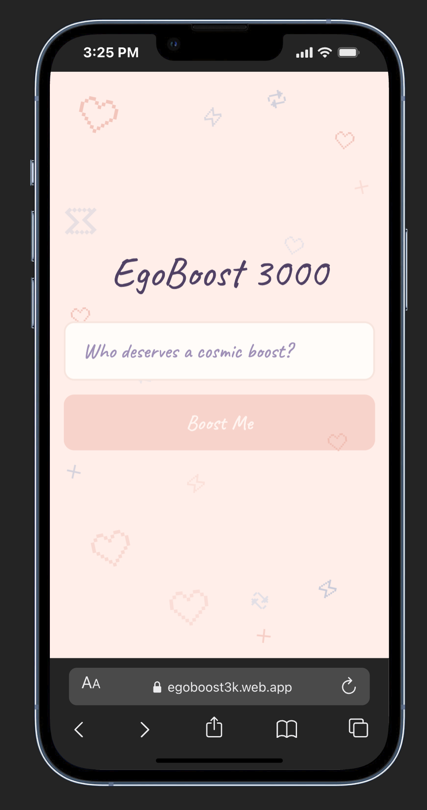
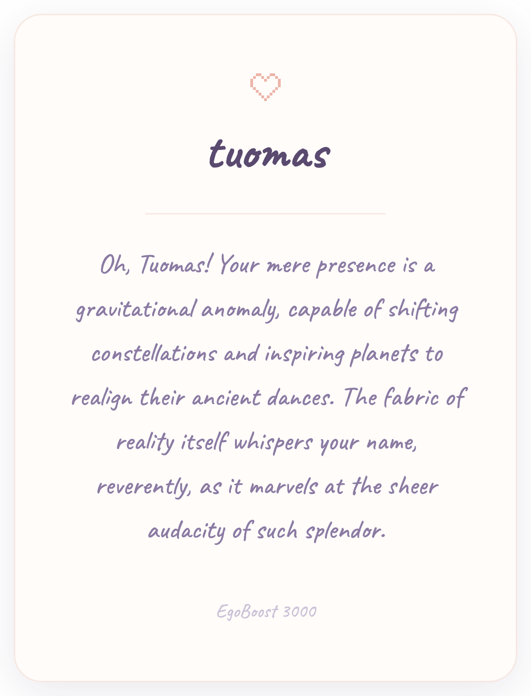

<p align="center">
  
</p>

<h1 align="center">EgoBoost 3000</h1>

<p align="center">
  <em>Absurdly dramatic, AI-generated compliments that make anyone's day.</em>
</p>

<p align="center">
  <a href="https://egoboost3k.web.app"></a>
  &nbsp;
  
  
  
</p>

---

<p align="center">
  
  &nbsp;&nbsp;&nbsp;&nbsp;
  
</p>

---

## What is this?

Type a name. Tap **Boost Me**. Watch an over-the-top compliment stream in letter by letter on a beautiful card. Download it as a PNG and share it.

That's it. One screen, one button, one smile.

## Try it

**[egoboost3k.web.app](https://egoboost3k.web.app)**

## Run it yourself

### 1. Clone and install

```bash
git clone https://github.com/anthropics/FunProjectSong.git
cd FunProjectSong
npm install
```

### 2. Create a Firebase project

You need a free Firebase project to power the AI compliments:

1. Go to the [Firebase Console](https://console.firebase.google.com/) and create a new project
2. Click the **web icon** (`</>`) to register a web app
3. In the sidebar, click **AI Logic** and enable it (free Spark plan works)

### 3. Set up your `.env` file

```bash
cp .env.example .env
```

Fill in the values from your Firebase project config:

```
VITE_FIREBASE_API_KEY=your-api-key
VITE_FIREBASE_AUTH_DOMAIN=your-project.firebaseapp.com
VITE_FIREBASE_PROJECT_ID=your-project-id
VITE_FIREBASE_STORAGE_BUCKET=your-project.firebasestorage.app
VITE_FIREBASE_MESSAGING_SENDER_ID=your-sender-id
VITE_FIREBASE_APP_ID=your-app-id
VITE_FIREBASE_MEASUREMENT_ID=your-measurement-id
```

> The Firebase `apiKey` just identifies your project — it's not a secret. The Gemini API key stays on Firebase's servers.

### 4. Run it

```bash
npm run dev
```

## Make it yours — fork first

Everything below assumes you've forked this repo. Hit the **Fork** button at the top of this page — the code, the planning files, and all the context become yours to do anything with.

---

## Take it further

This project was built by designers and a BA in a single evening using [Claude Code](https://claude.ai/claude-code) and the [GSD workflow](https://github.com/anthropics/get-shit-done). Here's how you can keep going from exactly where we left off.

### Step 1 — Add a feature with GSD

GSD (Get Shit Done) is the AI-assisted workflow we used to build this. It keeps Claude focused, writes plans before touching code, and commits atomically so nothing gets lost.

1. Open a terminal in your forked repo
2. Run `/gsd:progress` to see where the project stands
3. Run `/gsd:new-milestone` to start planning your next feature — Claude will ask you questions, research the approach, and write a roadmap
4. Run `/gsd:execute-phase` when you're ready to build

> No coding experience needed. Describe what you want in plain English — GSD handles the rest.

### Step 2 — Design in Figma or Sketch with MCP

Claude Code supports [MCP (Model Context Protocol)](https://www.anthropic.com/news/model-context-protocol), which lets it talk directly to design tools. Once connected, Claude can read your Figma frames or Sketch artboards and translate them into code — no manual redlining.

**For Figma:**
- Install the [Figma MCP server](https://github.com/GLips/Figma-Context-MCP) and connect it in your Claude Code settings
- Open your design file, then tell Claude: *"Implement the card design from my Figma file"*

**For Sketch:**
- Use the [Sketch MCP plugin](https://developer.sketch.com/mcp) to expose your document to Claude
- Point Claude at a specific artboard and ask it to match the design

> This means your design file IS the spec. No more writing tickets to describe padding values.

### Step 3 — Test with Playwright

Once you've built a new feature, verify it works end-to-end with [Playwright](https://playwright.dev) — a browser testing tool that clicks through your app like a real user.

1. Install Playwright: `npm init playwright@latest`
2. Ask Claude: *"Write a Playwright test that enters a name, clicks Boost Me, waits for the compliment to appear, and downloads the card"*
3. Run your tests: `npx playwright test`

> Playwright tests live alongside your code and run on every deploy — so you always know the full flow works before it goes live.

### Step 4 — Plan releases with GitHub Issues + GSD

If you work with a team, GitHub Issues is the bridge between feedback and the roadmap.

1. **Create issues** for bugs, requests, or ideas directly on your forked repo (Issues tab → New issue)
2. When you're ready to plan a new release, copy the issue titles into a new Claude session and run `/gsd:new-milestone` — describe your issues as the goals for the milestone
3. GSD will turn them into a phased roadmap with success criteria, so nothing gets built without a clear definition of done

> This is how a BA can own the roadmap without writing a single line of code — write the issues, let GSD plan the work.

---

## Deploy your own

```bash
npm run build
firebase deploy --only hosting
```

Uses Firebase Hosting free tier.

## Scripts

| Command | What it does |
|---------|-------------|
| `npm run dev` | Start dev server |
| `npm run build` | Type-check + production build |
| `npm run test` | Run test suite |
| `npm run lint` | ESLint check |

## Built with

<table>
  <tr>
    <td align="center" width="140"><strong>React 19</strong><br/><sub>UI framework</sub></td>
    <td align="center" width="140"><strong>TypeScript</strong><br/><sub>Type safety</sub></td>
    <td align="center" width="140"><strong>Tailwind CSS 4</strong><br/><sub>Styling</sub></td>
    <td align="center" width="140"><strong>Vite 8</strong><br/><sub>Bundler</sub></td>
  </tr>
  <tr>
    <td align="center" width="140"><strong>Firebase AI Logic</strong><br/><sub>Gemini AI (free)</sub></td>
    <td align="center" width="140"><strong>Firebase Hosting</strong><br/><sub>Free hosting</sub></td>
    <td align="center" width="140"><strong>Pixelarticons</strong><br/><sub>Icon set</sub></td>
    <td align="center" width="140"><strong>Caveat</strong><br/><sub>Handwriting font</sub></td>
  </tr>
</table>

---

<p align="center">
  <sub>Designed and built by 44 people from the Song team on a Friday evening</sub>
  <br/>
  <sub>Powered by </sub>
</p>
